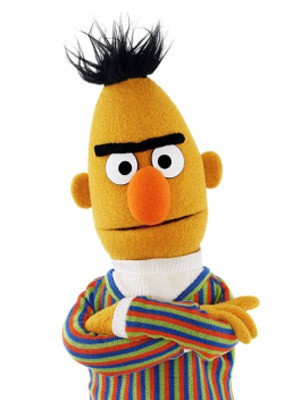
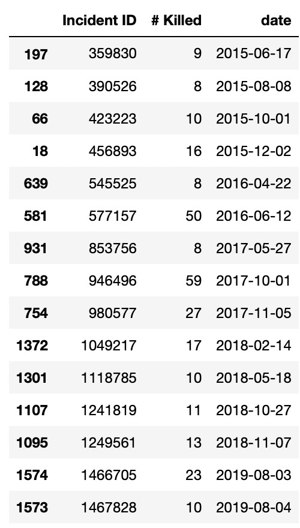
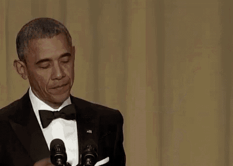

<h1 align="center"> DataShot </h1>

<h2 align="center"> Public perspective on gun ownership and violence in relation to gun shooting events over time.</h2>

### Introduction :

#### Abstract:

Gun ownership and regulation is a very divisive topic in the United States. It is clear that the country faces a problem with **gun violence**, this is reflected by the **yearly 14 000 deaths following gun related homicides** (statistic for 2019). However, people's opinions over how this problem should be tackled differ greatly.

In the case of our project, we basically want to know :

&quot;Who is thinking what and when?&quot;.

This includes, political **shifts in opinion**, the impact of shooting events in the public eye, and the **temporal evolution** of public opinions.

We wish to include an external dataset containing shooting events information and cross-reference with the QuoteBank dataset to see how given events influence what is said publicly, and how much these events take over the press.

#### Research questions:

How do general opinions in the media shift following gun shooting events?

How does the political sphere, and the opinion of significant public figures, evolve in relation to gun shootings?

#### Methods:

The first step of the project was to import the Quotebank dataset as well as the gun violence related dataset into  2 separate DataFrame for further analysis. The gun violence dataset was obtained from the following [website](https://www.gunviolencearchive.org/). The quotes have been filtered over a set of key-words that relate to gun violence, see below the list of keywords and their distribution across dataset.  We also have filtered out incomplete and meaningless quotes, by removing quotes shorter than a certain word count threshold. For the gun violence dataset, we selected a subset of events based on the number of deaths. We choose a threshold of 7 deaths by visually analyzing the graphs.

We needed to identify whether the person quoted is sharing a positive or negative opinion with respect to gun ownership. Sentimental analysis was applied to quotes to see wheter they display a positive or negative sentiment. Furthermore, we performed emotional analysis to see the evolution of particular emotions, namely fear, anger, sadness, agression, joy, optimism. There already exist numerous sentiment classification algorithms online which are available and we need to select the best ones for the purpose of the project. We settled on Vader and Bert. Finally we classified the quotes in 3 categories: positive, neutral or negative, based on their score *insert classifier decision here*. Later on, we decided to apply emotion analysis to observe the evolution of different emotions around gun shootings events.

This website will present our work and our final analysis, for more informations or to see the source code, refer to the github repository (link on top of this article).

#### Dataset filtering

We started our work by filtering the Quotebank dataset with a set of keywords. We manually selected relevant terms generated from the Empath library, and applied these keywords to the complete dataset. We then searched for character encoding errors but didn't find anything too problematic. After working on subsequent analysis, we found out that it was best to remove quotes from unknown speakers as they generated a lot of noise. We also chose to remove quotes where the only keyword found was "firearm", "assault weapon" or "handguns", as they also seemed to generate some noise. When these keywords were associated with another word however we kept them. In order to remove meaningless quotes, we also removed quotes with less than 5 words, this value was chosen arbitrarly as we expect to only keep meaningful quotes by doing so. 
Here you can see the top 10 most present keywords throughout our dataset.

#### Identifying subtopic - LDA

After treating the dataset, we wished to identify relevant subtopics. To do so, we performed topic detection using lda. However, we found out that 99.9% of our quotes lie in a single topic, characterized by keywords that are all relevant to gun violence (and often similar to the key words used to filter the data). This implies that our dataset doesn't contain too much noise. We plotted below the results of this analysis.

#### Timewise comparison
The next step was to compare the time occurences of peak in quotations number to the events timeline in order to get a first intuition on the potential correlation. On the next graph you can observe the number of quotes related to gun events on the same timeline as the number of deaths in gun shootings event. The idea behind this comparaison is that events involving high number of deaths would have more impact on the number of quotations.

After having explored to carry our analysis over all the times series data of the quotes vs gun shots events deaths, possibly due to noise from quotes not directly related to gunshot violence events but linked to significant events like political elections or pro gun control protests picked up by media outlets, we limited ourserlves to just a handful of events with high number of deaths. 
In general we observe that peaks in deaths from shootings events are correlated with an increase in the number of quotes related to gun violence. In short, people talk about gun violence more when there are a lot of shooting events.

#### Sentiment analysis - which quotes are on the dark side...

##### Vader vs BERT
  

###### Vader 
We decided to use vader as it is built for social media where sentiment are very polarized and we would expect sentiment towards gun violence to also be quite polarized in a similar way to political arguments. We applied it to the filtered quotes and obtained the following result:

As you can see, we observed a really unbalanced result, with a skew towards negative sentiment. We suspect that it is a consequence of the Vader sentiment analysis struggling to properly classify the quotes. We would have expected a more bimodal distribution. Looking at some of the quotes, some of them are really hard to classify even as human readers. In addition to the previous point, Vader is a statistical model not able to get the contexts of the words and given that we expect all the quotes to display strong feelings towards the subject, by using strong words and expressions that might bias the classification.

###### BERT
BERT to the rescue! We explored a more refined sentiment analysis method by implementing a fine-tuned BERT on a google play store reviews dataset. We obtained the following results.

Despite having been fin-tuned on a dataset not strictly related to news article, we can clearly see that it is much more balanced than vader. After also having looked at a couple of quotes, we assume that it is a satisfying result for the purpose of our analysis.

We also transformed the quotes into 768-dimensional embedding vectors with a pretrained BERT expert model trained on  wikipedia and book corpus, and fine-tuned on SST-2 dataset in order to be employed for sentiment analysis tasks. We applied principal component analysis to the vector embeddings to reduce the dimensionality to 2.

#### Emotion extraction 
Fearing that sentiment score might be too restrictive, we chose to take our analysis further than a simple positive/negative split and investigated the main emotions that came up within quotes. We turned to the empath library and chose a range of emotions from the standard categories. These were: anger, aggression,  joy, pride, nervousness, suffering, fear, neglect, deception, disgust, optimism, sadness and disappointment. 

###### Entire dataset
We first ran lexicon.analyse() function on all quotes related to gun violence and plotted emotions that yielded significant results. Emotions were averaged over a month to reduce the noise from variation. This is shown below:

Aggression is what appears the most. This is either because people speak agressively about gun violence or because our chosen theme is inherently violent and matches with a lot of keywords that might be considered as "aggressive", probably both. Furthermore, we notice a slight increasing trend in agression over the entire dataset. 
We also notice that speakers regularly express fear and sadness. Funnily enough, there seems to be a big peak in those two emotions in the time frame following the 2016 presidential election. We also note optimism and finally, we notice speakers usually display little anger, disapointment and joy.  

###### Significant shootings
We then ran the same analysis for the fifteen "significant" gun shooting events in the five days before and after each event. The emotion scores were averaged over a day. The result is shown below:

The plots have a lot of noise and there is no way of accounting for other shooting events that may have occured within that timeframe. Some seemingly "small" shootings can have big repercussions in the media if they are filmed, or happen at the "right" time... There could be a series of other unobserved constraints such as an election, a rally, or a mass shooting abroad, which would influence the resut of this plot so its' results must be taken with a grain of salt. 
Nevertheless, we often notice that there is a small spike in emotions following a shooting event. This is most notable for aggression, sadness and anger.

A small note, the event on the 12th of June 2016 generates an odd plot, this is not a coding error, we genuinely have not identified any quotes relating to gun violence on the five days prior to this event. It seems to be part of the numerous "blanks" that appear in 2016. 

###### Significant speakers
Finally, in the aim of understanding the opinions of significant public figures, we identified the top 10 speakers who appear the most in our dataset and plotted their individual emotion scores averaged over a day. The result is shown below:

We firstly note that there is a lot of noise, high variance, and long "blank" periods as individual speakers are not quoted everyday with respect to gun violence. We can nonetheless extract some information from these graphs.

Barack Obama is often sad when talking about gun violence. 

Hillary Clinton is aggressively active on the gun violence topic prior to the 2016 election, but suddenly falls silent following her loss. Perhaps she was using this highly politiced topic as a tool to gain following among the community that supports wider gun control?

David Hogg appears from nowhere in 2018 following the Stoneman Douglas High School shooting in which he was a victim, and we notice he talks about gun violence with a lot of aggression and fear.

Richard Blumenthal and Chris Murphy are two members of the US Senate, who are in favour of gun control. They seem to regularly talk about the subject, and do so expressing a lot of aggression and fear. 

Alan Gottlieb, a conservative political activist and gun rights advocate also regularly talks about gun violence. He seems to do so expresing regular suffering, fear, agression, but also optimism ... This last emotion is not displayed as often be speakers who would favour gun control.

Bernie Sanders seems to talk about gun violence almost exclusively in the lead up to the 2016 and 2020 elections. Perhaps a political tool?

#### Shootings event and number of quotes correlation analysis

We did a selection of important shooting events first by visualising which events trigger a noticeable spike in number of quotes. This appears to concern events with at least 7 deaths appart from a few exception that we choose to drop as we consider having a statisfying number of event to analyse. We are left with the following 15 events:

To further quantify this relation between shooting events and the number of quotation, we do a time lagged cross correlation for each of the selected events on a time window of one week before and after the event.

This time lagged analysis allows us to take into account the fact that as we can expect, the quotation spike appear after the event.

#### Sentiment shift around significant shooting events
As explained in the Vader vs BERT section and after unsuccesful attempts at using the Vader labels, we grouped by the sentiment categories given by the output of the fine-tuned BERT over every day in a time window of 1 week before and after the event. We implement this approach first for all the quotes and then for the quotes of particular speakers. We chose the 3 events who provide enough information before and after the event to draw some conclusions, which happens to be in top 4 events of the number of deaths.

 
From the above plots, we can infer 3 main points. First, we see that the daily total number of quotes increases massively just after the shooting event. Second, the sentiment distribution is significantly skewed towards negative (for example in the first plot we see almost double the negative quotes in respect to the positive ones).  Thirdly from our limited number of samples we observe that the overall buzz and sentiment towards gunshot violence seem to come back to the levels precedent to the gunshot event just a couple of days after the date of the latter. This might be anectodal evidence of the typical media behavior jumping on hot topics one after the other in a matter of days.

#### Conclusion
After so many tears, blood and sweat...

We observed a correlation between a shooting event and the number of quotes, but as we know, correlation doesn't imply causation. Even though we tried to reduce the noise as much as posssible, there are still too many hidden cofactors that could bias our analysis. Outside events can have a lot of impact on the number of quotes, either directly (in the case of the gun violence rally in early 2018 for example) or indirectly, because if another significant event generates a lot of quotes, we will have less focus on the gun violence topic. 

Nevertheless, we identified a significant increase in the number of quotes related to gun violence, a significant shift in sentiment towards negtive values, and a spike in negative emotions (i.e. aggression, sadness and fear) following a shooting even. Furthermore, we showed that sentiment distribution quickly shifts back to the "norm" in the days following events. 

We also noticed signicant figures display varying types of emotion with respect to gun violence. Alan Gottlieb, a gun activist, displayed more hope than others, while Barack Obama showed more sadness. We've also been given hints that gun violence is used as a political tool by presidential canditates, such as Bernie Sanders and Hillary Clinton. 

  

